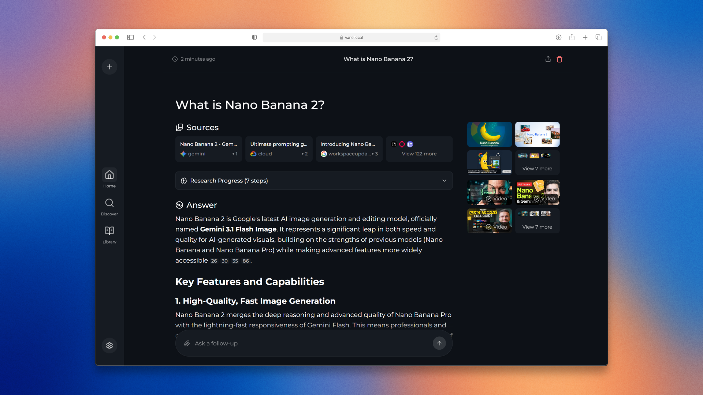
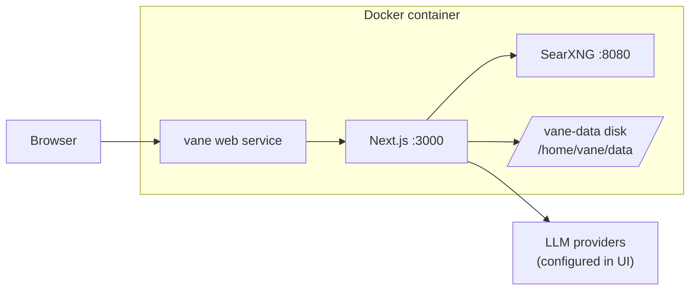

# Vane on Render

> Self-hosted AI answering engine with cited web search, bundled SearXNG, and SQLite on a persistent disk.

[](https://render.com/deploy-template/api/github/start?template_repo=vane)

Deploy [Vane](https://github.com/ItzCrazyKns/Vane) on Render as one Docker web service. The template builds from source in this repo: Next.js, Playwright, and SearXNG run in the same container. Search history, uploads, and provider settings persist on a Render disk at `/home/vane/data`. You configure LLM API keys in Vane's setup screen after the first deploy, not in the Blueprint Apply step.



---

## Table of contents

- [Why deploy Vane on Render](#why-deploy-vane-on-render)
- [Use cases](#use-cases)
- [What gets deployed](#what-gets-deployed)
- [Quickstart](#quickstart)
- [Configuration](#configuration)
- [Cost breakdown](#cost-breakdown)
- [Customization](#customization)
- [Operations](#operations)
- [Upgrading](#upgrading)
- [Troubleshooting](#troubleshooting)
- [FAQ](#faq)
- [Security](#security)
- [Caveats and limitations](#caveats-and-limitations)
- [Credits and license](#credits-and-license)

## Why deploy Vane on Render

- **Bundled SearXNG in one service** — Vane talks to SearXNG on `localhost:8080` inside the container; you do not provision a separate search engine.
- **Persistent disk for SQLite** — Chat history, uploads, and setup-screen configuration survive redeploys at `/home/vane/data`.
- **Standard plan by default** — Playwright and SearXNG exceed Starter RAM; the Blueprint uses the **Standard** web plan (2 GB).
- **HTTPS on `*.onrender.com`** — Render terminates TLS; you add a custom domain in the Dashboard when you are ready.

## Use cases

- **Private research assistant** with cited answers and file Q&A for a team or lab.
- **Self-hosted alternative to hosted AI search** without running Docker Compose on a laptop.
- **Multi-provider LLM testing** (OpenAI, Anthropic, Groq, Gemini, OpenAI-compatible endpoints) from one UI.
- **Domain-restricted search** for documentation sites, papers, or known-good sources.
- **Time-boxed demo** on a Render URL before you commit to long-term self-hosting.

## What gets deployed



| Resource | Type | Plan | Purpose |
|----------|------|------|---------|
| `vane` | Web (Docker) | Standard | Builds from `./Dockerfile`; runs Vane + SearXNG + Playwright |
| `vane-data` | Persistent disk (1 GB) | Disk storage | SQLite database, uploads, local config |

Region defaults to **Oregon** in [`render.yaml`](./render.yaml). Change the `region` field before deploy if you want another region.

## Quickstart

[](https://render.com/deploy-template/api/github/start?template_repo=vane)

1. Click **Deploy to Render** and choose the GitHub account that receives the template fork.
2. Review the Blueprint (`vane` web service + `vane-data` disk) and click **Apply**. No secrets are required at Apply time.
3. Wait for the first Docker build (~15–25 minutes). SearXNG is cloned and Playwright browsers are installed during the image build.
4. Open the `*.onrender.com` URL when the service status is **Live** and the health check on `/` returns 200.
5. Complete Vane's setup screen: add at least one chat model provider and save. Bundled SearXNG is already wired to `http://localhost:8080` inside the container.
6. Run a test search. Confirm sources appear in the answer panel before you share the URL.

## Configuration

### Required secrets

**None.** Provider API keys are entered in Vane's setup UI after deploy and stored in SQLite on the persistent disk.

| Env var | What it's for | How to get it |
|---------|---------------|---------------|
| None | No Blueprint secrets at Apply time | Configure providers in the Vane setup screen after deploy |

### Auto-generated secrets

**None.** This Blueprint does not use `generateValue: true` env vars.

| Env var | Purpose |
|---------|---------|
| None | No auto-generated application secrets |

### Wired automatically from other resources

**None.** This is a single-service template with no `fromDatabase` or `fromService` references.

| Env var | Source |
|---------|--------|
| None | Single web service + attached disk only |

### Optional tweaks

Defaults are set in [`render.yaml`](./render.yaml) and the Dockerfile. Override in the Render Dashboard or in your fork's Blueprint.

| Env var | Default | What it does |
|---------|---------|--------------|
| `NODE_ENV` | `production` | Runs Next.js in production mode |
| `DATA_DIR` | `/home/vane` | App root. Vane writes persistent data to `$DATA_DIR/data` (SQLite, config, uploads), which is the disk mounted at `/home/vane/data`. Do not set this to `/home/vane/data`: paths double-nest and the DB fails to open. |
| `PORT` | `3000` | Port Vane binds inside the container; must match Render's health check target |
| `SEARXNG_API_URL` | `http://localhost:8080` (Dockerfile) | Internal SearXNG URL for the bundled search engine |

Upstream configuration reference: [Vane installation docs](https://github.com/ItzCrazyKns/Vane/tree/master/docs/installation) and [.env.example](./.env.example).

## Cost breakdown

| Resource | Plan | Monthly cost |
|----------|------|--------------|
| `vane` | Web service Standard | $25 |
| `vane-data` | 1 GB disk ($0.25/GB) | $0.25 |
| **Total** | | **$25.25** |

See [Render pricing](https://render.com/pricing) for current plan and disk rates. LLM provider usage is billed separately by each vendor.

**Cheaper:** Downgrading to Starter ($7) is not recommended; Playwright and SearXNG often OOM during startup on 512 MB instances.

**Scale up:** Increase the web service plan to **Pro** for more CPU/RAM, or raise `disk.sizeGB` in `render.yaml` if SQLite and uploads outgrow 1 GB. Horizontal scaling is not available with an attached disk.

## Customization

### Pin an upstream release

This template builds from source on every deploy. To pin a release, check out a tag in your fork and push:

```bash
git checkout v1.12.2   # example; use a tag that exists upstream
git push origin main
```

### Switch to the upstream prebuilt image

To skip source builds, change the web service in `render.yaml` to `runtime: image`:

```yaml
runtime: image
image:
  url: docker.io/itzcrazykns1337/vane:latest
```

Remove `dockerfilePath` and `dockerContext`. First deploy is faster; you lose the ability to patch app code in the fork without changing the image tag.

### Add a custom domain

In the Render Dashboard, open **vane** → **Settings** → **Custom Domains** → **Add**. Render provisions TLS after DNS is configured. See [Custom domains](https://render.com/docs/custom-domains).

### Resize the persistent disk

```yaml
# render.yaml
disk:
  name: vane-data
  mountPath: /home/vane/data
  sizeGB: 5
```

Disks can grow but not shrink. Pick the smallest size that fits expected uploads and search history.

### Use an external SearXNG instance

Build from `Dockerfile.slim`, deploy SearXNG as a [private service](https://render.com/docs/private-services), and set:

```yaml
envVars:
  - key: SEARXNG_API_URL
    value: http://<your-searxng-host>:<port>
```

The external instance must enable JSON responses. Upstream docs recommend enabling the Wolfram Alpha engine.

### Enable preview environments

This template sets `previews.generation: off` because gallery deploys are one-shot forks. To test PRs on Render:

```yaml
previews:
  generation: manual
```

Preview services with disks follow the same single-instance constraints as production.

## Operations

### Backups

Render creates automatic disk snapshots for `vane-data` (daily retention per your workspace plan). Restore from the service **Disks** page. Snapshots are full-disk restores: you cannot restore individual files through the Dashboard.

SQLite lives at `/home/vane/data/db.sqlite` (that is `$DATA_DIR/data/db.sqlite` with `DATA_DIR=/home/vane`), on the persistent disk. Config (`config.json`) and uploads sit alongside it under `/home/vane/data`.

### Monitoring

Use the service **Metrics** and **Events** pages. The Blueprint sets `healthCheckPath: /`. A 200 from `/` means nginx/Next.js is responding; it does not prove SearXNG or a specific LLM provider is configured.

### Scaling

The attached disk limits the service to **one instance**. Autoscaling and zero-downtime deploys are not available. Scale vertically by changing the instance plan.

### Logs

Dashboard → **vane** → **Logs**, or with the [Render CLI](https://render.com/docs/cli):

```bash
render logs --resources <service-id> --tail
```

Look for `Starting SearXNG...`, `SearXNG started successfully`, and `Starting Vane...` during startup. Build logs show Docker stages for SearXNG pip install and Playwright browser download.

## Upgrading

### Pick up upstream releases

1. Check [Vane releases](https://github.com/ItzCrazyKns/Vane/releases) and release notes.
2. Merge or cherry-pick upstream into your fork (this repo tracks upstream on the default branch).
3. Push to GitHub. Render auto-deploys if enabled on your fork.
4. Watch deploy logs. Database migrations run on boot via Next.js instrumentation.
5. Re-open the setup screen if upstream adds new required configuration.

### Breaking-change migrations

Maintain a short log in your fork when you bump major versions:

- **v1.12.2 (template baseline):** Full image bundles SearXNG; local state under `/home/vane/data`. Provider keys live in SQLite, not Render env vars.
- **Future releases:** Read upstream release notes before merging. Confirm `DATA_DIR`, SearXNG ports, and setup-screen flows still match this Blueprint.

## Troubleshooting

### Deploy fails during Docker build

The Dockerfile clones SearXNG, installs Python dependencies, and downloads Playwright Chromium. First builds often take 15–25 minutes. If the build times out, retry the deploy or temporarily raise the service plan during the first build. Check build logs for npm, pip, or git clone failures.

### Health check fails / service never goes Live

Common causes: OOM on Starter, Vane not listening on `PORT=3000`, or SearXNG still starting. Confirm `plan: standard` in `render.yaml`. Check runtime logs for process exits before the health probe succeeds. Wait up to 60 seconds after deploy for SearXNG's startup loop in `entrypoint.sh`.

### `unable to open database file` or migrations fail on first boot

Vane derives its paths from `DATA_DIR`: the database is `$DATA_DIR/data/db.sqlite` and migrations are read from `$DATA_DIR/drizzle`. `DATA_DIR` must be the app root (`/home/vane`), so the data lands on the disk mounted at `/home/vane/data` and the migrations resolve to the folder baked into the image. If you set `DATA_DIR=/home/vane/data`, the paths double-nest (`/home/vane/data/data/db.sqlite`) and the DB directory does not exist on a fresh disk, so the open fails and the setup screen errors. Keep `DATA_DIR=/home/vane`.

### Vane reports no chat model providers configured

Open the setup screen and add at least one provider. For OpenAI-compatible servers, the endpoint must be reachable **from Render**, not from your laptop. `http://localhost:11434` inside the Vane UI points at the container, not your local Ollama process.

### Search results are empty or SearXNG errors appear

Confirm logs show SearXNG listening on port 8080. The default `SEARXNG_API_URL` is `http://localhost:8080`. If you switched to `Dockerfile.slim`, verify your external SearXNG URL is reachable from the private network and returns JSON.

### Data disappears after a deploy

Only files under `/home/vane/data` persist. Confirm the disk is attached at `/home/vane/data` and that `DATA_DIR=/home/vane` (Vane writes to `$DATA_DIR/data`). Anything written elsewhere on the container filesystem is ephemeral.

### Out of memory / "No open ports detected"

Symptoms include heap OOM errors, repeated restarts, or Render reporting no listening port. Stay on **Standard** or upgrade to **Pro**. Do not downgrade to Starter unless you have verified memory usage in your own fork.

### Where to get more help

- **Service logs:** Dashboard → **vane** → **Logs**
- **Deploy events:** Dashboard → **vane** → **Events**
- **Template issues:** [render-examples/vane issues](https://github.com/render-examples/vane/issues)
- **Application bugs:** [ItzCrazyKns/Vane issues](https://github.com/ItzCrazyKns/Vane/issues)

## FAQ

### Can I run this on Render's free plan?

No. This template requires a persistent disk and a Standard (or larger) web instance for reliable startup. Free web services also cannot attach disks.

### Where do I put OpenAI, Anthropic, or Groq API keys?

In Vane's setup screen after deploy. Keys are stored in SQLite on the disk, not in Render environment variables.

### Can I use Ollama on my laptop with this deploy?

Not by default. The Render container cannot reach `localhost` on your machine. Expose Ollama on a reachable HTTPS endpoint or use a cloud LLM provider.

### What happens if I delete the disk?

You lose persisted SQLite data, uploads, and setup configuration for that service. Restore from a disk snapshot if one exists.

### Can I export data from the disk later?

Yes, manually. Use Render shell/SSH (if enabled on your plan) or an app-level export to copy files from `/home/vane/data`. There is no one-click export in this template.

### Can I scale Vane horizontally?

No. Render disks attach to a single instance. Scale vertically by changing the instance plan.

### How is this different from `docker run itzcrazykns1337/vane:latest`?

Same bundled layout (Vane + SearXNG in one container), but Render adds managed HTTPS, deploy hooks from Git, and a persistent disk mounted at `/home/vane/data`. This template builds from source in your fork instead of pulling a prebuilt tag on every deploy.

## Security

- **Encryption in transit:** Render terminates TLS for public `*.onrender.com` URLs and custom domains.
- **Encryption at rest:** Render encrypts persistent disks at the platform level.
- **Network exposure:** The Vane UI is public on the web service URL. SearXNG on port 8080 is not exposed through Render's public proxy; only the Vane port is routed.
- **Secrets:** LLM provider keys live in SQLite on the disk. Restrict Render Dashboard access to teammates who should read service logs or env vars.
- **Authentication:** Vane does not ship end-user auth in this template. Treat the URL as sensitive or place an identity-aware proxy in front if you need access control.
- **Vulnerability reports:** Template packaging issues → [render-examples/vane](https://github.com/render-examples/vane/issues). Application vulnerabilities → [upstream Vane](https://github.com/ItzCrazyKns/Vane/issues).

## Caveats and limitations

- **Single instance only** because of the attached disk; no autoscaling or zero-downtime deploys.
- **Long first build** (~15–25 minutes) when building from source; subsequent deploys reuse cached Docker layers when possible.
- **Source build on every deploy** unless you switch to `runtime: image` in your fork.
- **No upstream auth gate** in this template (unlike Basic Auth wrappers). Anyone with the URL can reach the setup screen until upstream adds authentication.
- **Ephemeral container filesystem** outside `/home/vane/data`; only the disk mount persists.
- **Regional pinning:** the default region is Oregon; cross-region private networking does not apply to this single-service template.

## Credits and license

- **Upstream:** [ItzCrazyKns/Vane](https://github.com/ItzCrazyKns/Vane) — MIT License
- **Render template:** [render-examples/vane](https://github.com/render-examples/vane) — MIT (see [LICENSE](./LICENSE))
- **Template maintainer:** [render-examples](https://github.com/render-examples)

If Vane is useful to you, star the [upstream repository](https://github.com/ItzCrazyKns/Vane).
