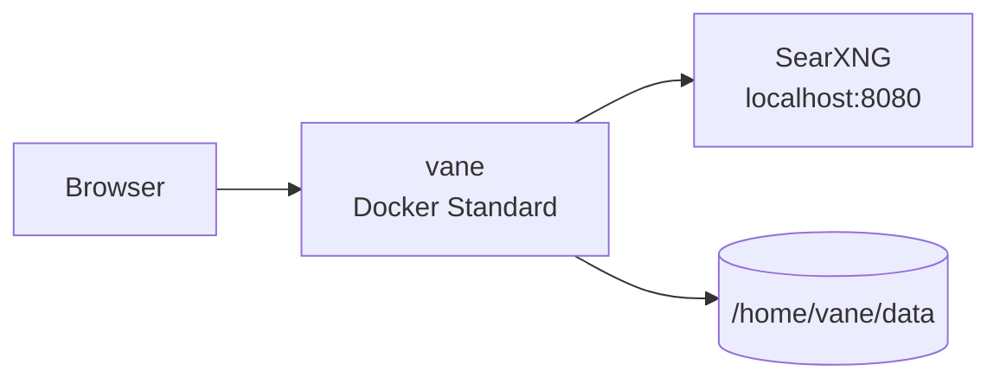

<div align="center">

# Vane on Render

Deploy **Vane**, a privacy-focused AI answering engine with bundled SearXNG, on Render as a single Docker web service with a persistent disk.

<p>
  <a href="https://render.com/deploy-template/api/github/start?template_repo=vane">
    
  </a>
</p>

<p>
  <a href="https://render.com">
    
  </a>
  <a href="https://github.com/ItzCrazyKns/Vane">
    
  </a>
</p>

</div>


## What This Template Shows

This repo packages [Vane](https://github.com/ItzCrazyKns/Vane) as a Render Blueprint (docker-fork): one Docker image runs Vane (Next.js) and SearXNG on `localhost:8080`, with SQLite and uploads on a disk.

| Piece | Role |
| --- | --- |
| **[Vane](https://github.com/ItzCrazyKns/Vane)** | Privacy-focused AI answering UI |
| **SearXNG** | Bundled search (inside the same container) |
| **[Render Web Service](https://render.com/docs/web-services)** | Docker app on **Standard** |
| **[Render Disk](https://render.com/docs/disks)** | SQLite / config / uploads under `/home/vane/data` |

## Architecture



### How It Works

1. Click **Deploy to Render**. Render forks this template and applies [`render.yaml`](./render.yaml).
2. Render builds `./Dockerfile` (Vane + SearXNG) on a Standard instance.
3. Open the `*.onrender.com` URL and complete first-run setup in the UI.
4. Chat history and uploads persist on the disk across deploys.
5. Configure LLM / providers in Vane's setup screens (not required at Apply).

| Resource | Type | Plan | Notes |
| --- | --- | --- | --- |
| `vane` | Web (`runtime: docker`) | **standard** | Health `/`; Playwright + SearXNG need 2 GB |
| `vane-data` | Disk (1 GB) |  | Mounted at `/home/vane/data` |

Default region: **oregon**. Previews are off. **Standard is the floor**: Starter OOMs with Playwright/SearXNG ("No open ports detected").

Important: `DATA_DIR` must be `/home/vane` (app root), not the disk mount path. Vane derives `data/db.sqlite` under that root so paths land on the mounted disk correctly.

## Quick Start

### Prerequisites

- A [Render account](https://dashboard.render.com/register?utm_source=github&utm_medium=referral&utm_campaign=ojus_demos&utm_content=readme_link)
- An LLM provider configured in Vane after first boot

### Deploy

1. Click **Deploy to Render** above and fork into your GitHub account.
2. On Apply, confirm the `vane` Standard service and disk.
3. Wait until **Live** (~8–15 minutes first image build).
4. Open the public URL and finish setup.
5. Ask a question and confirm answers return with search.

Smoke test:

```bash
curl -sS -o /dev/null -w "%{http_code}\n" https://<your-vane>.onrender.com/
```

## Features

| Feature | Description |
| --- | --- |
| **Single container** | Vane + SearXNG, no separate search service |
| **Persistent SQLite** | Disk at `/home/vane/data` |
| **Docker fork** | Builds from `./Dockerfile` |
| **One-click Blueprint** | `projects` / `environments` |
| **Standard by default** | Sized for Playwright + SearXNG |

## Configuration

| Variable | Source | Description |
| --- | --- | --- |
| `NODE_ENV` | Wired | `production` |
| `DATA_DIR` | Wired | `/home/vane` (do not set to the mount path) |
| `PORT` | Wired | `3000` |

LLM and other product settings are configured in the Vane UI after deploy.

## Cost

| Resource | Approx. monthly |
| --- | ---: |
| Web (Standard) | ~$25 |
| Disk (1 GB) | ~$0.25 |
| **Total** | **~$25** |

LLM usage is billed by your provider. Do not drop to Starter.

## Troubleshooting

| Problem | Solution |
| --- | --- |
| Health check fails / no open ports | Keep **Standard**. Check build logs for OOM. |
| DB / migration errors on boot | Confirm `DATA_DIR=/home/vane` and disk mounted at `/home/vane/data`. |
| Search empty | SearXNG runs in-container on `localhost:8080`; check app logs. |
| Data lost after redeploy | Disk must remain attached. |

## Project Structure

```
render.yaml       Render Blueprint (Docker web + disk)
README.md         This file
LICENSE           MIT (template / upstream)
Dockerfile        App + SearXNG image
src/ …            Vane source (docker-fork)
assets/           Hero / screenshots
```

## Learn More

**Render:**
- [Web Services](https://render.com/docs/web-services)
- [Disks](https://render.com/docs/disks)
- [Blueprints](https://render.com/docs/infrastructure-as-code)

**Vane:**
- [Upstream repo](https://github.com/ItzCrazyKns/Vane)

## License

[MIT](LICENSE) for this template package.

Upstream [Vane](https://github.com/ItzCrazyKns/Vane) is MIT. Star that repo if this helped.
