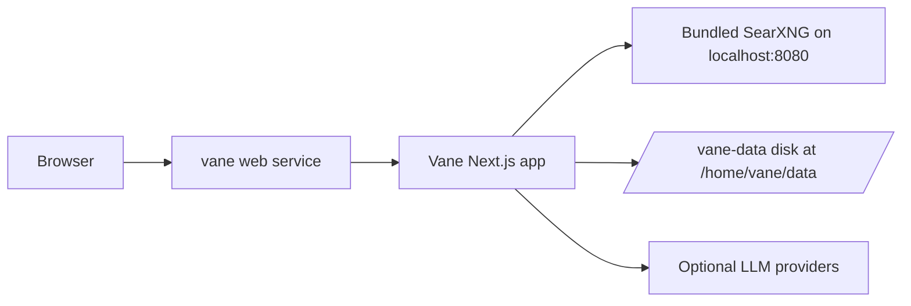

# Vane on Render

> Deploy Vane as a self-hosted AI answering engine with bundled SearXNG search and persistent local data.

[](https://render.com/deploy-template/api/github/start?template_repo=vane)

This template runs the official Vane Docker image on a Render web service. Vane gives you a self-hosted search and answer interface that can use local or hosted LLM providers, cite sources, upload files, and keep search history on a persistent disk.

## Before you deploy

- This template uses the full Vane image, which starts Vane and a bundled SearXNG process in the same service.
- The default instance type is `standard` because Vane is a real Node.js app with Playwright and SearXNG included.
- The template attaches a persistent disk at `/home/vane/data`, so the service is single-instance and does not use zero-downtime deploys.
- You configure model providers, API keys, and local LLM endpoints in Vane's setup screen after the first deploy.

## Table of contents

- [Why deploy Vane on Render](#why-deploy-vane-on-render)
- [Use cases](#use-cases)
- [What gets deployed](#what-gets-deployed)
- [Quickstart](#quickstart)
- [Configuration](#configuration)
- [Cost breakdown](#cost-breakdown)
- [Customization](#customization)
- [Operations](#operations)
- [Upgrading](#upgrading)
- [Troubleshooting](#troubleshooting)
- [FAQ](#faq)
- [Security](#security)
- [Caveats and limitations](#caveats-and-limitations)
- [Credits and license](#credits-and-license)

## Why deploy Vane on Render

- **One-click deployment:** The Blueprint creates the service, image, env vars, and disk.
- **Bundled search:** SearXNG runs inside the same image, so no separate search service is required.
- **Persistent state:** The disk preserves Vane's local database and search history across deploys.
- **Managed HTTPS:** Render gives the web service a TLS-protected `*.onrender.com` URL.
- **Simple updates:** Pin a new upstream image tag and redeploy from the Render Dashboard.

## Use cases

What you can run with this template:

- **Private AI search:** Ask questions against web search results with cited sources.
- **LLM provider testing:** Compare local Ollama models with OpenAI, Anthropic, Gemini, or Groq.
- **Research workspace:** Keep search history and uploaded documents in one self-hosted app.
- **Team demo:** Share a Vane instance on a temporary Render URL for internal evaluation.
- **Browser search shortcut:** Add the deployed URL as a browser search engine.

## What gets deployed



| Resource | Type | Plan | Purpose |
|----------|------|------|---------|
| `vane` | Web service using `runtime: image` | `standard` | Runs the official Vane image and exposes the web UI |
| `vane-data` | Persistent disk, 5 GB | Disk storage | Stores Vane's local state under `/home/vane/data` |

Region: `oregon`. Change the `region` field in `render.yaml` before deploy if you want a different region.

## Quickstart

1. Click **[Deploy to Render](https://render.com/deploy-template/api/github/start?template_repo=vane)**.
2. Choose the GitHub account or organization that will receive your fork.
3. Review the Blueprint resources and click **Apply**.
4. Wait for the image pull and service start, which usually takes 3 to 8 minutes on the first deploy.
5. Open the `*.onrender.com` URL after the deploy is `Live`.
6. Complete Vane's setup screen with your preferred model provider and search settings.

## Configuration

### Required secrets

**None.** Vane's provider keys are configured in the application setup screen after deployment.

| Env var | What it's for | How to get it |
|---------|---------------|---------------|
| None | No required Blueprint secrets | Configure providers inside Vane |

### Auto-generated secrets

**None.** The Blueprint does not generate application secrets.

| Env var | Purpose |
|---------|---------|
| None | No generated secrets |

### Wired automatically from other resources

**None.** This template uses one web service with an attached disk, so no `fromDatabase` or `fromService` wiring is needed.

| Env var | Source |
|---------|--------|
| None | Single-service template |

### Optional tweaks

Common things people change after deploying:

| Env var | Default | What it does |
|---------|---------|--------------|
| `PORT` | `3000` | Tells Vane which port to bind for public web traffic |
| `SEARXNG_API_URL` | `http://localhost:8080` | Points Vane at the bundled SearXNG process |
| `NODE_ENV` | Set by the image or runtime | Keeps the Next.js app in production mode |

Vane also stores provider-specific configuration in the setup screen. For upstream app behavior, see the [Vane README](https://github.com/ItzCrazyKns/Vane).

## Cost breakdown

| Resource | Plan | Monthly cost |
|----------|------|--------------|
| `vane` | Web service `standard` | $25 |
| `vane-data` | 5 GB disk at $0.25/GB | $1.25 |
| **Total** | | **$26.25** |

Render's full pricing is available on [Render Pricing](https://render.com/pricing). Workspace plan costs, bandwidth overages, and future service changes are billed separately.

**Cheaper:** Change the web service plan to `starter` only after you confirm the container starts reliably in 512 MB of RAM.

**Scale up:** Move the service to `pro` or larger if Vane handles more concurrent users, large uploads, or heavier model-provider traffic.

## Customization

### Pin the upstream version

This template pins Vane to `v1.12.2`. To use another release, change the image tag:

```yaml
# render.yaml
image:
  url: docker.io/itzcrazykns1337/vane:v1.12.2
```

Prefer versioned tags over `latest` so redeploys are repeatable.

### Add a custom domain

In the Render Dashboard, open the service, then go to **Settings** > **Custom Domains** > **Add Custom Domain**. Render issues TLS automatically after DNS is configured. See [Custom Domains](https://render.com/docs/custom-domains) for DNS setup.

### Resize the persistent disk

Increase the disk if Vane's local database, history, or uploaded files outgrow 5 GB:

```yaml
# render.yaml
disk:
  name: vane-data
  mountPath: /home/vane/data
  sizeGB: 10
```

Render disks can grow, but they cannot shrink. Pick the smallest size that fits your expected usage.

### Use an external SearXNG service

If you already operate SearXNG elsewhere, switch to the slim Vane image and set `SEARXNG_API_URL`:

```yaml
# render.yaml
image:
  url: docker.io/itzcrazykns1337/vane:slim-latest
envVars:
  - key: SEARXNG_API_URL
    value: https://your-searxng.example.com
```

Your SearXNG instance must enable JSON responses. Vane's upstream docs also recommend enabling the Wolfram Alpha search engine.

### Enable preview environments

This template disables previews because gallery deploys are one-shot deployments from each user's fork. To test pull requests against Render, change:

```yaml
previews:
  generation: manual
```

Preview services with disks have the same single-instance and storage constraints as production.

## Operations

### Backups

Render creates automatic disk snapshots every 24 hours and keeps them for at least 7 days. Restore snapshots from the service's **Disks** page in the Render Dashboard.

Disk snapshots are full restores. You cannot restore a single file, and restoring a snapshot overwrites newer disk changes.

### Monitoring

Use the service's **Metrics** and **Events** pages in the Render Dashboard to monitor deploys, memory, CPU, and restarts. The Blueprint sets `healthCheckPath: /`, so Render checks the Vane home page.

### Scaling

The persistent disk makes this service single-instance. You can vertically scale by changing the service plan, but you cannot run multiple instances while the disk is attached.

Disk-backed services do not use zero-downtime deploys. Expect a short interruption when the service restarts for deploys or configuration changes.

### Logs

In the Render Dashboard, open the service and select **Logs**. With the Render CLI, run:

```bash
render logs --resources <service-id> --tail
```

Look for both Vane startup logs and SearXNG startup logs. The full image starts SearXNG first, waits briefly, then starts the Vane server.

## Upgrading

### Pick up upstream releases

1. Check the upstream [Vane releases](https://github.com/ItzCrazyKns/Vane/releases).
2. Confirm the matching Docker image tag exists on Docker Hub.
3. Update `image.url` in `render.yaml`.
4. Commit and push the change to trigger a deploy.
5. Review the service logs and complete any Vane setup-screen migrations.

### Breaking-change migrations

Watch the upstream release notes before upgrading across major versions. Known template-specific notes:

- **v1.12.2:** Initial template pin. The full image bundles SearXNG and stores local state under `/home/vane/data`.
- **Future releases:** Re-check the Dockerfile and README for changed ports, storage paths, or setup-screen behavior before bumping the image tag.

## Troubleshooting

### Deploy fails during image pull

The image tag might not exist, Docker Hub might be temporarily unavailable, or the image name might have changed upstream. Confirm the tag with:

```bash
docker manifest inspect docker.io/itzcrazykns1337/vane:v1.12.2
```

If the tag is missing, choose a published tag from the upstream release notes and update `render.yaml`.

### Service starts but health check fails

The container might still be starting, SearXNG might be slow to initialize, or the service might be binding a different port than Render expects. Keep `PORT=3000` in `render.yaml` because the upstream image exposes Vane on port 3000.

Check logs for `Starting SearXNG...`, `Starting Vane...`, and any process exits before the health check timeout.

### Vane says no chat model providers are configured

Complete the setup screen and add at least one provider. For local OpenAI-compatible servers, the provider must be reachable from Render. A URL like `http://localhost:11434` points at the Render container, not your laptop.

For local Ollama on your own machine, expose it through a reachable private network or public HTTPS endpoint. Do not put sensitive provider endpoints in a public README.

### Search results are empty or SearXNG errors appear

The full image should set `SEARXNG_API_URL=http://localhost:8080`. If you changed to the slim image, make sure your external SearXNG instance enables JSON responses and is reachable from Render.

### Data disappears after deploy

Only files under `/home/vane/data` are persisted by this template. If an upstream Vane release moves uploaded files or the SQLite database outside that path, update the disk mount path or add an app-level export step before upgrading.

### The service runs out of memory

The usual symptoms are `JavaScript heap out of memory`, repeated restarts, or Render reporting no open ports because the process exits before binding. Keep the `standard` plan or scale up. Downgrading to `starter` is not recommended unless you have verified startup memory in your own fork.

### Anything else

- Service logs: Render Dashboard > service > **Logs**.
- Deploy events: Render Dashboard > service > **Events**.
- Template issues: open an issue in this template repository.
- Application bugs: open an issue in the [upstream repo](https://github.com/ItzCrazyKns/Vane/issues).

## FAQ

### Can I run this on Render's free plan?

Not with the default template. Vane needs a persistent disk for local state, and the full image is more likely to fit on `standard` than on a 512 MB instance. You can experiment with smaller plans in a fork, but the template does not default to them.

### Why use the full image instead of the slim image?

The full image includes SearXNG. That makes the one-click template self-contained and avoids asking users to operate a separate search service before Vane can answer questions.

### Can I use my own SearXNG instance?

Yes. Switch to the slim image and set `SEARXNG_API_URL` to your SearXNG URL. The external SearXNG instance must be reachable from Render and configured for JSON responses.

### Where do I put OpenAI, Anthropic, Gemini, Groq, or Ollama settings?

Use Vane's setup screen after the deploy is live. This keeps provider keys out of `render.yaml` and out of the template repository.

### What happens if I delete the disk?

You lose Vane's persisted local state for this service, including anything stored under `/home/vane/data`. Restore from a Render disk snapshot if one is available and recent enough.

### Can I move my data off the disk later?

Yes, but it is a manual export. Use SSH or another app-level export path to copy files from `/home/vane/data`, then import them into your next environment.

### Can I scale Vane horizontally?

Not with the attached disk. Render disks attach to one service instance, so this template scales vertically by changing the instance type.

## Security

- **Encryption at rest:** Render persistent disks are encrypted at rest.
- **Encryption in transit:** Render terminates TLS for the public `*.onrender.com` URL and any configured custom domains.
- **Network exposure:** The Vane web UI is public by default. The bundled SearXNG process listens inside the container and is not exposed as a separate public service.
- **Secret handling:** Provider keys entered in Vane are handled by Vane, not by this Blueprint. Avoid committing provider keys to this repo.
- **Access control:** Review Vane's upstream authentication status before exposing the service to untrusted users.
- **Reporting vulnerabilities:** Report template problems in this repo. Report Vane application issues upstream through [GitHub Issues](https://github.com/ItzCrazyKns/Vane/issues).

## Caveats and limitations

- The service is public unless you add app-level authentication, a private network pattern, or another access-control layer.
- Disk-backed services are single-instance and do not use zero-downtime deploys.
- The template pins `v1.12.2`. You need to update `render.yaml` to pick up upstream releases.
- The full image includes SearXNG, Playwright, and browser dependencies. Keep the `standard` plan unless you verify a smaller plan yourself.
- Local LLMs on your laptop are not reachable from Render by default.
- Only `/home/vane/data` is mounted as persistent storage in this template.

## Credits and license

- **Upstream:** [ItzCrazyKns/Vane](https://github.com/ItzCrazyKns/Vane), licensed under MIT.
- **Render template:** MIT. See [LICENSE](./LICENSE).
- **Template maintainer:** [render-examples](https://github.com/render-examples).

If this template helped you, give the upstream Vane repo a star.
