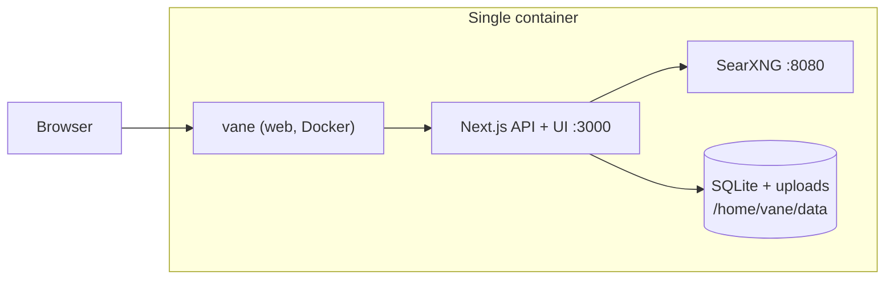

# Vane on Render

> Privacy-focused AI answering engine with cited sources, bundled SearXNG, and SQLite-backed settings on a persistent disk.

[](https://render.com/deploy-template/api/github/start?template_repo=vane-render-template)

Deploy [Vane](https://github.com/ItzCrazyKns/Vane) on Render as a single Docker web service. The upstream image builds Next.js, Playwright, and SearXNG into one container. Search history, uploaded files, and provider settings persist on a Render disk mounted at `/home/vane/data`.


**Deploy from this fork today:** [Blueprint deploy (render-template branch)](https://render.com/deploy?repo=https://github.com/ojusave/Vane&branch=render-template)

---

## Table of contents

- [Why deploy Vane on Render](#why-deploy-vane-on-render)
- [Use cases](#use-cases)
- [What gets deployed](#what-gets-deployed)
- [Quickstart](#quickstart)
- [Configuration](#configuration)
- [Cost breakdown](#cost-breakdown)
- [Customization](#customization)
- [Operations](#operations)
- [Upgrading](#upgrading)
- [Troubleshooting](#troubleshooting)
- [FAQ](#faq)
- [Security](#security)
- [Caveats and limitations](#caveats-and-limitations)
- [Credits and license](#credits-and-license)
- [Publishing this template](#publishing-this-template)

---

## Why deploy Vane on Render

- **One service, full stack** — Vane and SearXNG run in the same container; no separate search engine to provision.
- **Persistent SQLite** — Chat history, uploads, and UI-configured API keys survive redeploys via a mounted disk.
- **Standard plan headroom** — Playwright and SearXNG need more than 512 MB RAM; this template defaults to **Standard** (2 GB).
- **Setup in the browser** — After the first deploy, open the app and configure LLM providers in Vane's setup screen (no Blueprint secrets required to boot).

## Use cases

- **Private research assistant** for a team with cited web answers and file Q&A.
- **Self-hosted Perplexica-style search** without running Docker Compose locally.
- **Multi-provider LLM playground** (OpenAI, Anthropic, Groq, Ollama endpoints, etc.) behind one UI.
- **Domain-restricted search** for docs, papers, or internal knowledge bases.
- **Demo or evaluation** of Vane before moving to your own infrastructure.

## What gets deployed



| Resource | Type | Plan | Purpose |
|----------|------|------|---------|
| `vane` | Web (Docker) | Standard | Next.js app, SearXNG sidecar process, Playwright |
| `vane-data` | Disk (1 GB) | — | SQLite DB, config, uploads, search history |

Region: **Oregon** (change `region` in `render.yaml` before deploy if you prefer another region).

**Pattern:** `docker-fork` — builds from `./Dockerfile` in the repo. Alternatives considered: `image-wrapper` (`itzcrazykns1337/vane:latest`, faster but less transparent), `native-runtime` (rejected: SearXNG + Playwright + system deps).

## Quickstart

1. Click **[Deploy to Render](https://render.com/deploy-template/api/github/start?template_repo=vane-render-template)** (after the template is published under `render-examples`), **or** use the [fork Blueprint URL](https://render.com/deploy?repo=https://github.com/ojusave/Vane&branch=render-template) on the `render-template` branch.
2. Connect GitHub and confirm the fork/Blueprint. No secrets are required at Apply time.
3. Wait for the Docker build (~15–25 minutes on first deploy; SearXNG clone + Playwright install are heavy).
4. Open the `*.onrender.com` URL when status is **Live**.
5. Complete Vane's in-app setup: add at least one chat model provider and save. SearXNG is pre-wired to `http://localhost:8080` inside the container.

## Configuration

### Required secrets

**None at Blueprint Apply time.** Vane stores provider API keys in SQLite after you use the setup UI. Add keys there on first visit.

### Auto-generated secrets

None. Render does not generate application secrets for this template.

### Wired automatically

| Env var | Source | Purpose |
|---------|--------|---------|
| `DATA_DIR` | `render.yaml` | SQLite and uploads path (`/home/vane/data`) |
| `NODE_ENV` | `render.yaml` | Production mode |
| `PORT` | `render.yaml` | Next.js listen port (`3000`) |
| `SEARXNG_API_URL` | Dockerfile | Internal SearXNG URL (`http://localhost:8080`) |

### Optional tweaks

| Env var | Default | What it does |
|---------|---------|--------------|
| `DATA_DIR` | `/home/vane/data` | Must match disk `mountPath` if you change the mount |
| `SEARXNG_API_URL` | `http://localhost:8080` | Only change if you split SearXNG into a separate private service (slim image workflow) |

Upstream install and provider docs: [Vane README](https://github.com/ItzCrazyKns/Vane/blob/master/README.md) and [docs/installation](https://github.com/ItzCrazyKns/Vane/tree/master/docs/installation).

## Cost breakdown

| Resource | Plan | Approx. monthly (Oregon) |
|----------|------|---------------------------|
| `vane` | Standard | ~$25 |
| `vane-data` | 1 GB disk | ~$0.25 |
| **Total** | | **~$25** |

Pricing changes: [render.com/pricing](https://render.com/pricing).

**Cheaper:** Not recommended below Standard for this stack; Playwright + SearXNG often OOM on Starter.

**Scale up:** Disk size is independent (`sizeGB` in `render.yaml`). Horizontal scaling is **not** supported with a persistent disk (single instance only).

## Customization

### Pin a Docker base or rebuild from a tag

This template builds from source on each deploy. To pin upstream, fork at a specific commit or tag before deploying:

```bash
git checkout v1.12.2   # example tag
git push origin render-template
```

### Use the upstream prebuilt image instead

Replace the web service in `render.yaml` with `runtime: image` and `image: url: docker.io/itzcrazykns1337/vane:latest`. You lose build-from-source transparency but cut first-deploy time. See **render-docker** for image syntax.

### Add a custom domain

Dashboard → **vane** → **Settings** → **Custom Domains** → **Add**. TLS is automatic. [Custom domains docs](https://render.com/docs/custom-domains).

### External SearXNG (advanced)

Build with `Dockerfile.slim`, deploy SearXNG as a [private service](https://render.com/docs/private-services), set `SEARXNG_API_URL` to the internal URL. Not included in this default template.

## Operations

### Backups

Disk snapshots are available in the Render dashboard for the `vane-data` disk. SQLite lives under `/home/vane/data/data/db.sqlite`.

### Monitoring

Use the service **Metrics** tab and **Logs**. Health check path: `/`.

### Scaling

**Single instance only** while a disk is attached. Autoscaling is disabled.

### Logs

Build logs show Docker stages (SearXNG pip install, Playwright browsers). Runtime logs include SearXNG startup and Next.js request lines.

## Upgrading

1. Merge upstream Vane releases into your fork (or pull latest on `render-template`).
2. Push to GitHub; Render auto-deploys if enabled.
3. Expect **brief downtime** on deploy (disk constraint: no zero-downtime deploys).

Run database migrations automatically on boot via Next.js instrumentation.

## Troubleshooting

### Build fails or times out

The Dockerfile installs SearXNG from source and Playwright Chromium. First builds often exceed 20 minutes. Retry deploy; use **Standard** plan or higher.

### "No open ports detected" / service never goes Live

Usually OOM on Starter. Upgrade to **Standard** in `render.yaml` and redeploy.

### SearXNG / search errors after deploy

Check logs for `Starting SearXNG...` and `SearXNG started successfully`. If SearXNG is slow to start, wait 30–60 seconds and refresh. External SearXNG requires JSON format and Wolfram Alpha enabled in SearXNG settings (bundled config includes these).

### Ollama or local LLM "connection refused"

Ollama runs **outside** Render by default. From the container use host-specific URLs (see upstream README): e.g. `http://host.docker.internal:11434` does **not** work on Render Linux. Point Vane at a publicly reachable Ollama endpoint or a cloud provider instead.

### Settings lost after deploy

Confirm the disk is mounted at `/home/vane/data` and `DATA_DIR` matches. Files written outside the mount path are ephemeral.

## FAQ

**Do I need Postgres?**  
No. Vane uses SQLite on the persistent disk.

**Can I deploy on the free plan?**  
Not reliably. The image is too heavy for Free/Starter RAM limits.

**Where do I put OpenAI / Anthropic keys?**  
In the Vane setup UI after first login, not in Render env vars (unless you customize the app).

**Does this template include authentication?**  
No. Upstream auth is on the roadmap; treat the deploy URL as sensitive or add your own gateway.

**Can I use Exa or Tavily instead of SearXNG?**  
Configure supported providers in the Vane UI per upstream docs.

**How is this different from the Docker one-liner?**  
Same container layout as `docker run ... itzcrazykns1337/vane:latest`, but with Render-managed TLS, disk, and deploys from your fork.

## Security

- TLS terminates at Render's edge.
- Disk data is encrypted at rest by the platform; SQLite contains your configured API keys: restrict dashboard access.
- SearXNG is not exposed publicly; only port 3000 is routed through Render's proxy.
- Rotate provider keys in the Vane UI if compromised.

## Caveats and limitations

- **Single instance** — persistent disk prevents horizontal scaling.
- **No zero-downtime deploys** with an attached disk.
- **Long builds** — source build every deploy unless you switch to `runtime: image`.
- **Ephemeral filesystem outside disk** — only `/home/vane/data` persists.
- **Free web spin-down** does not apply to paid Standard services, but avoid Free tier for this stack entirely.

## Credits and license

- **Vane** by [ItzCrazyKns](https://github.com/ItzCrazyKns/Vane) — MIT License
- **Render template** — Blueprint and docs on the `render-template` branch

## Publishing this template

Follow the internal [Publishing a template](https://dx-process-and-kb.onrender.com/docs/processes/publishing-a-template) process. Summary:

```bash
# 1. Create render-examples repo from this branch
gh repo create render-examples/vane-render-template --public \
  --source=/path/to/Vane --push --description "Vane AI answering engine on Render"

# 2. Mark as GitHub template repository
gh api -X PATCH repos/render-examples/vane-render-template -f is_template=true

# 3. Verify
gh api repos/render-examples/vane-render-template --jq '{url:.html_url, is_template:.is_template}'

# 4. Ensure README Deploy button uses:
# https://render.com/deploy-template/api/github/start?template_repo=vane-render-template

# 5. Validate Blueprint
render blueprints validate render.yaml

# 6. Submit gallery metadata to the Render templates team (hero.png, cost, slug)
```

Before gallery submission, smoke-test the Deploy button end-to-end and confirm status **Live** plus in-app setup works.
